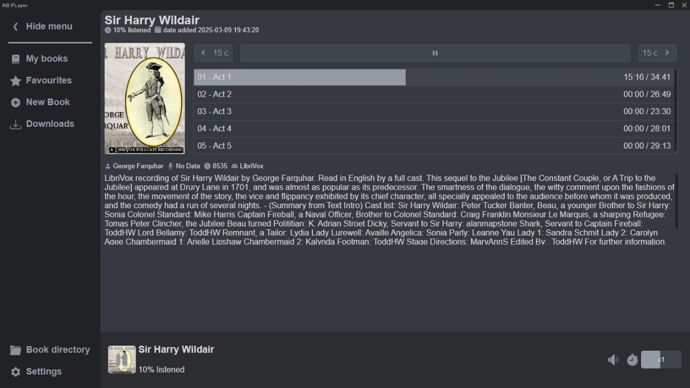

# AudioBook Player [](https://www.python.org/downloads/) [](https://github.com/AlexDev-py/AudioBookPlayer/blob/master/LICENSE) []()

**Audio Book Player** - приложение для Windows, которое позволит вам бесплатно слушать и скачивать аудио книги.

Приложению доступны все книги, которые есть на сайтах [_akniga.org_](https://akniga.org/) и [_knigavuhe.org_](https://knigavuhe.org/).
У этих сайтов огромные библиотеки аудио книг различных жанров и авторов, 
но как правило сайты с аудио книгами не дают пользователям возможности скачивать свои аудио книги.
**Audio Book Player** же даёт такую возможность бесплатно без смс и регистрации.

## Обзор интерфейса

**Библиотека**

Здесь находятся все ваши книги. 

**Книги**

Удобный плеер, позволяющий в 1 клик перемещаться по главам книги.
> Перед прослушиванием аудио книги, вам нужно будет скачать её.

> Все книги скачиваются в определённую папку, которую вы можете изменить в настройках приложения.

> Книги сохраняются в формате MP3

**Поиск**

Для добавления книги в свою библиотеку достаточно указать ссылку, 
ведущую на страницу книги одного из доступных сайтов.

## Установка

Для начала скачайте установочный файл по этой [ссылке](#)(ссылки нет, но вы держитесь).

После запуска Вас поприветствует мастер установки и попросит нажать "Далее". Сделайте это.

В следующем окне мастер попросит вас выбрать, какие компоненты необходимо установить. 
В небольшом окошке будет всего 2 пункта **Chrome** и **AB Player**.
**Chrome** - тот самый браузер Google Chrome. Его наличие необходимо для работы приложения. 
Но даже если у Вас уже установлен этот браузер, не стоит снимать галочку с этого компонента, 
Ваш браузер просто обновиться до последней версии. 
**AB Player** - Приложение, которое Вы и хотели установить. 
Когда вы выбрали, что устанавливать, нажмите на кнопку "Далее".

Следующим этапом будет выбор места, куда устанавливать приложение. Вы можете выбрать любое удобное для вас место.

После нажатия на кнопку "Установить" запустится процесс установки. Это может занять некоторое время.

Когда все компоненты будут установлены, мастер сообщит об этом. Нажмите на кнопку "Готово".

Для удобства мастер создает несколько ярлыков программы: один в меню Пуск, второй на рабочем столе.

Готово! Вы спокойно можете пользоваться приложением.

## Для разработчиков

Вы можете скачать исходники проекта с помощью git.
```commandline
git clone https://github.com/AlexDev-py/AudioBookPlayer.git
```

или загрузить архив, используя [ссылку](https://github.com/AlexDev-py/AudioBookPlayer/archive/refs/heads/master.zip).

Далее вам необходимо создать виртуальное окружение 
и установить все зависимости проекта. Используйте это, находясь в директории проекта.
```commandline
python -m venv venv
venv\Scripts\activate.bat
pip install -r requirements.txt
```

Для запуска приложения из консоли необходимо выполнить это, находясь в директории проекта:
```commandline
venv\Scripts\activate.bat
cd ABPlayer
python main.py
```