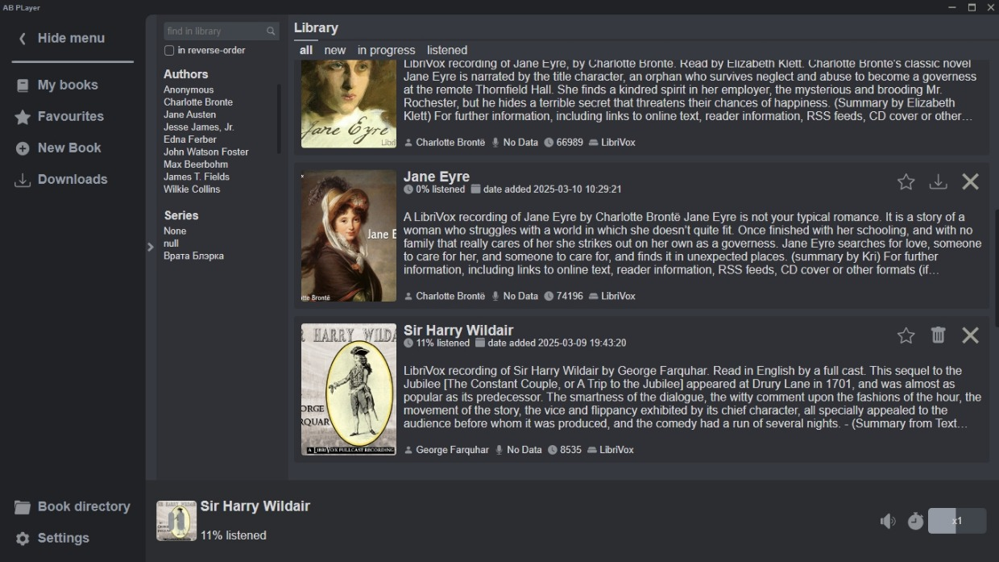
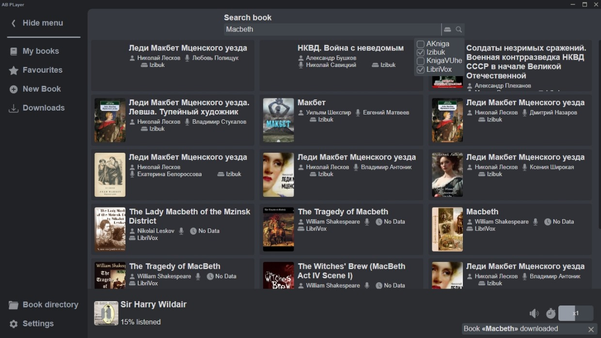

# AudioBook Player [](https://www.python.org/downloads/) [](https://github.com/AlexDev505/AudioBookPlayer/blob/master/LICENSE) []()

[_english version_](https://github.com/AlexDev505/AudioBookPlayer/blob/master/readme_en.md)

**Audio Book Player** - приложение для Windows, которое позволит вам бесплатно слушать и скачивать аудио книги.

Приложению доступны все книги, которые есть на сайтах [_akniga.org_](https://akniga.org/), [_knigavuhe.org_](https://knigavuhe.org/), [_izib.uk_](https://izib.uk), [_yakniga.org_](https://yakniga.org) и [_librivoxaudio_](https://archive.org/details/librivoxaudio).
У этих сайтов огромные библиотеки аудио книг различных жанров и авторов, 
но как правило сайты с аудио книгами не дают пользователям возможности скачивать свои аудио книги.
**Audio Book Player** же даёт такую возможность бесплатно без смс и регистрации.

## Обзор интерфейса

**Библиотека**

Здесь находятся все ваши книги.

**Поиск**


**Прослушивание**

Приложение дает возможность слушать, скачанные книги. 
Удобная навигация по главам, настройка скорости воспроизведения, 
сохранения прогресса прослушивания.

## Установка

Для начала скачайте установочный файл со [страницы последнего релиза](https://github.com/AlexDev505/AudioBookPlayer/releases/latest).

После запуска Вас поприветствует мастер установки, который поможет установить приложение.

Для удобства мастер создает несколько ярлыков программы: один в меню Пуск, второй на рабочем столе.

Готово! Вы спокойно можете пользоваться приложением.

## Для разработчиков

Вы можете скачать исходники проекта с помощью git.
```commandline
git clone https://github.com/AlexDev505/AudioBookPlayer.git
```

или загрузить архив, используя [ссылку](https://github.com/AlexDev505/AudioBookPlayer/archive/refs/heads/master.zip).

Далее вам необходимо создать виртуальное окружение 
и установить все зависимости проекта. Используйте это, находясь в директории проекта.
```commandline
python -m venv venv
venv\Scripts\activate.bat
pip install -r requirements.txt
```

Для запуска приложения из консоли необходимо выполнить это, находясь в директории проекта:
```commandline
venv\Scripts\activate.bat
cd ABPlayer
python main.py
```