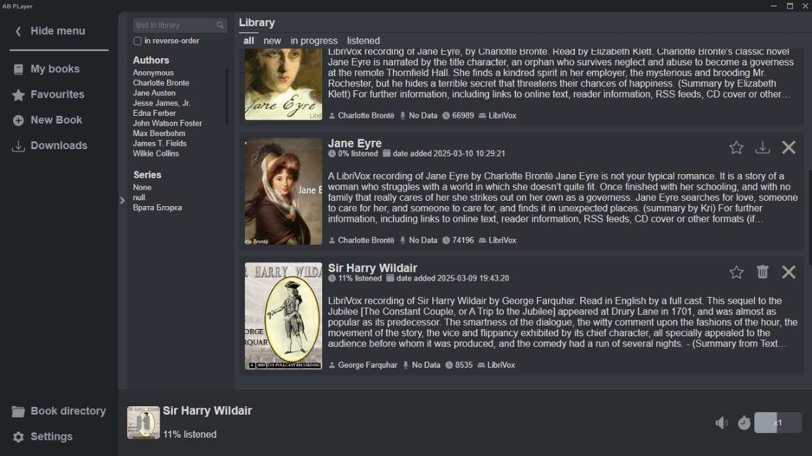
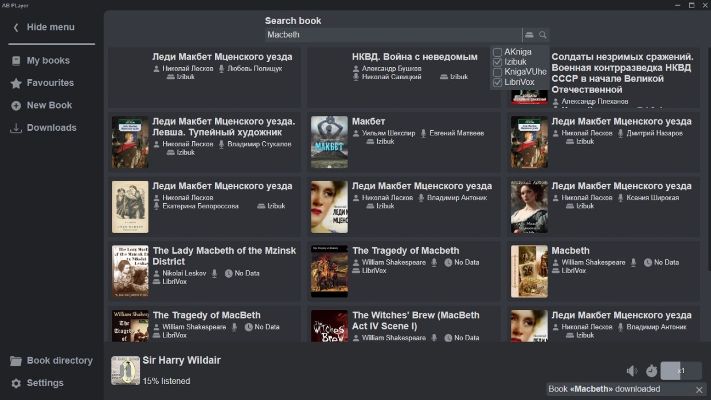
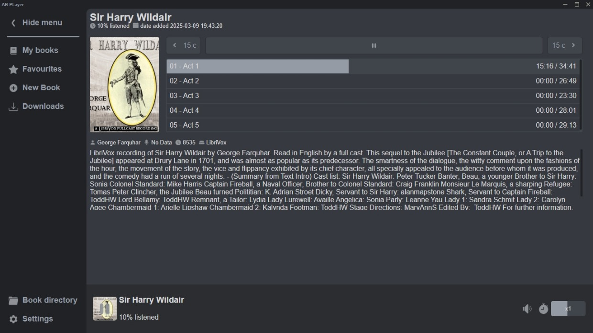

# AudioBook Player [](https://www.python.org/downloads/) [](https://github.com/AlexDev505/AudioBookPlayer/blob/master/LICENSE) []()

[_русская версия_](https://github.com/AlexDev505/AudioBookPlayer/blob/master/readme.md)

**Audio Book Player** - an application for Windows that allows you to listen to and download audiobooks for free.

The application has access to all the books available on the websites [_akniga.org_](https://akniga.org/), [_knigavuhe.org_](https://knigavuhe.org/), [_izib.uk_](https://izib.uk), [_yakniga.org_](https://yakniga.org) and [_librivoxaudio_](https://archive.org/details/librivoxaudio).
These websites have huge libraries of audiobooks of various genres and authors,
but typically audiobook websites do not allow users to download their audiobooks..
**Audio Book Player** however, provides this opportunity for free without SMS and registration.

## Interface Overview

**Library**

Here are all your books.

**Search**


**Listening**

The application allows you to listen to downloaded books.
Convenient chapter navigation, playback speed adjustment,
and progress saving.

## Installation

First, download the installer from the [latest release page](https://github.com/AlexDev505/AudioBookPlayer/releases/latest).

After launching, you will be greeted by the installation wizard, which will help you install the application.

For convenience, the wizard creates several shortcuts for the program: one in the Start menu, and another on the desktop.

Done! You can now use the application.

## For Developers

You can download the project source code using git.
```commandline
git clone https://github.com/AlexDev505/AudioBookPlayer.git
```

or download the archive using [this link](https://github.com/AlexDev505/AudioBookPlayer/archive/refs/heads/master.zip).

Next, you need to create a virtual environment 
and install all project dependencies. Use this while in the project directory.
```commandline
python -m venv venv
venv\Scripts\activate.bat
pip install -r requirements.txt
```

To run the application from the console, execute this while in the project directory:
```commandline
venv\Scripts\activate.bat
cd ABPlayer
python main.py
```

Thanks for english localization: [Koladweep](https://github.com/Koladweep)